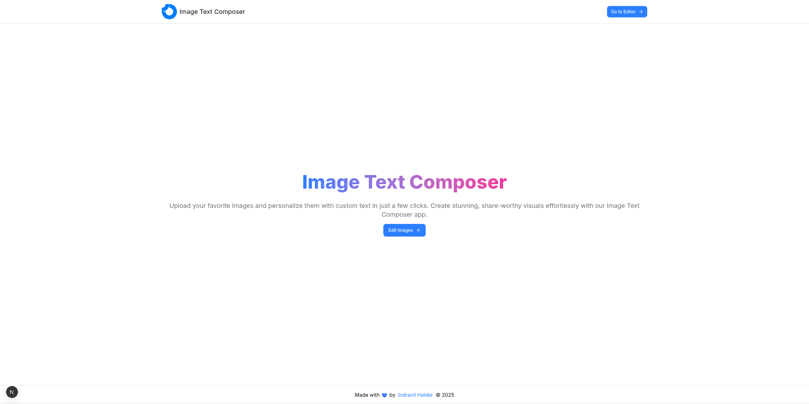
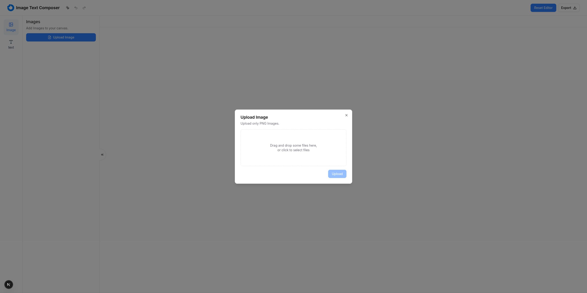
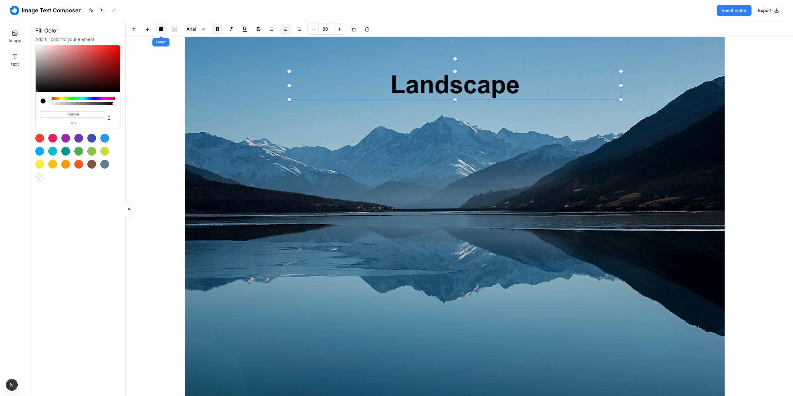
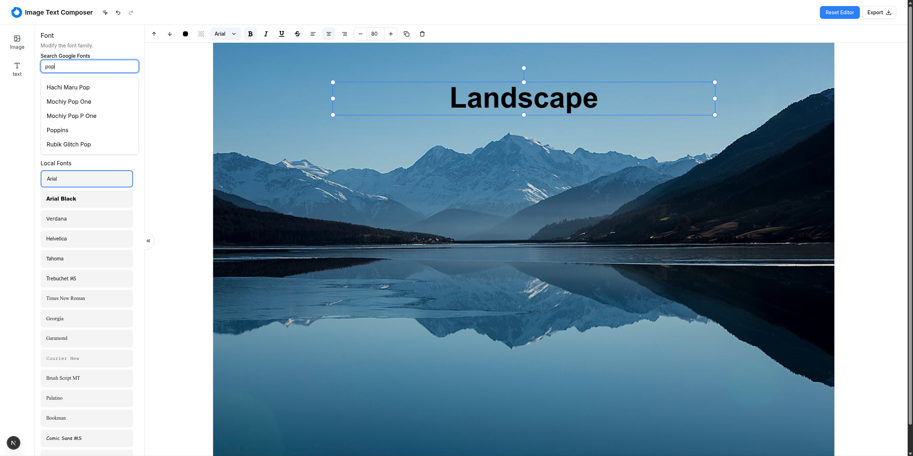

# Image Text Composer






## Installation and Usage Instructions

Before running this application locally, you need to have [Node.js](https://nodejs.org/) and [yarn](https://yarnpkg.com/) installed on your system, alternatively you can use [npm](https://www.npmjs.com/). Once you have both installed, follow these steps to set up and run the application locally:

1. Clone the repository:

   ```bash
   git clone https://github.com/indranildeveloper/image-text-composer.git
   ```

2. Navigate to the project directory:

   ```bash
   cd image-text-composer
   ```

3. Copy the `.env.example` file and rename that to `.env.local`. Then add the environment variable for the Google Fonts API key:

   ```bash
   NEXT_PUBLIC_GOOGLE_FONTS_API_KEY=<NEXT_PUBLIC_GOOGLE_FONTS_API_KEY>
   ```

4. Install dependencies:

   ```bash
   yarn install
   ```

5. Start the development server:

   ```bash
   yarn dev
   ```

6. Build the production version:

   ```bash
    yarn build
   ```

7. Start the production server:

   ```bash
   yarn start
   ```

## Description

This is a web application that allows you to edit images and add text to images. It uses the [Fabric.js](https://fabricjs.com/) library to create and manipulate images and text elements. Apart from that it uses Next.js and Typescript for building the application.

Here I have followed the best practices to make the code maintainable and easy to understand. Every feature of this application is separated and can be easily understood. Inside the `/src/features` folders we can create new features for the editor or if we want to extend the application the new features (e.g. dashboard, AI Tools etc) can be added there.

## Technologies Used

1. `Next.js`for building the application.
2. `Typescript` for writing the type safe code.
3. `Fabric.js` for creating and manipulating images and text elements.
4. `Tailwind CSS` for styling the application.
5. `Shadcn UI` as the `Tailwind UI Library`.
6. `react-dropzone` for drag and drop file upload functionality.
7. `react-colors` for color picker.
8. `react-use` for custom hooks.
9. `lucide-react` and `react-icon` for icons.
10. `eslint` and `prettier` for linting and formatting the code, and `husky` for git hooks.

## Bonus points implemented:

1. Multi-select with group transforms.
2. Duplicate Layers.
3. Custom keyboard shortcuts for copy, paste, select all, save undo, redo, delete.

## Known Limitations:

1. The application is not responsive yet. Responsiveness of the canvas can be added through `ResizeObserver` with a custom hook.
2. The changes in the canvas are saved in the local storage. But we can optimize that by using a `debounced` save function.
3. No tests for the code were written. We can write tests for the code using `jest` or `vitest` with `react-testing-library`.
